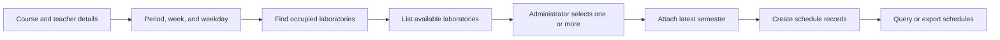
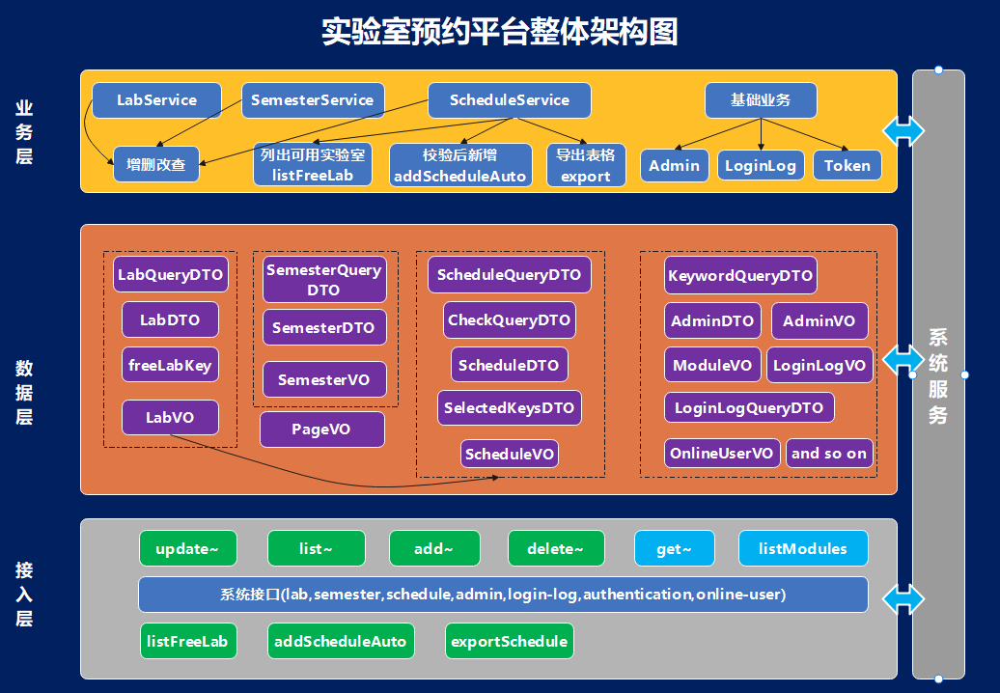

# Laboratory Reservation System · Backend

**A Spring Boot API that helps an administrator find conflict-free laboratories, create teaching schedules, and manage the supporting academic data.**

[](build.gradle)
[](build.gradle)
[](src/main/resources/mapper/)
[](data/demo.sql)
[](LICENSE)

This repository contains the backend half of a full-stack software-engineering course project. It exposes REST endpoints for laboratory, semester, schedule, administrator, login-log, and online-user management. The matching React application lives in [lab-reservation-system-web-frontend](https://github.com/JaspinXu/lab-reservation-system-web-frontend).

## What this project demonstrates

- A layered Spring Boot application organized around controllers, services, DTOs, persistence models, view objects, and MyBatis mappers.
- Availability checking across comma-separated class periods, teaching weeks, and weekdays.
- Automatic schedule creation for one or more selected laboratories, using the latest semester record.
- Module-level operator privileges enforced with custom annotations, a request filter, and Spring AOP.
- Paginated administration screens, login auditing, active-session inspection, and forced sign-out.
- Excel import and export for laboratory and schedule records through Apache POI.
- OpenAPI documentation generated from the running service.

## Reservation workflow



The availability query treats period, week, and weekday as three independent sets. A laboratory is excluded when an existing schedule overlaps the requested values. The administrator may select multiple available laboratories when one room cannot accommodate the class.

## Architecture



```text
HTTP request
    │
    ├── TokenFilter                session lookup
    └── TokenCheckAspect           annotation-based privilege check
            │
            ▼
       Controller → Service → Mapper XML → MySQL
            │
            ▼
       ResponseData / Page / view object
```

The course implementation stores the selected laboratory name and semester name directly on each schedule record. These are deliberate snapshot fields rather than database foreign keys.

## Tech stack

| Area | Technology |
| --- | --- |
| Runtime | Java 21 |
| Framework | Spring Boot 3.2, Spring Web, Spring AOP |
| Persistence | MyBatis 3, MySQL 5.7 or 8.x |
| API documentation | Springdoc OpenAPI 3 |
| File exchange | Apache POI |
| Utilities | Lombok, Fastjson2, UserAgentUtils |
| Build | Gradle Wrapper |

## API areas

| Base path | Responsibility |
| --- | --- |
| `/api/authentication` | Login, current user, logout, and session heartbeat |
| `/api/lab` | Laboratory CRUD and Excel import/export |
| `/api/semester` | Semester CRUD and latest-term lookup |
| `/api/schedule` | Schedule CRUD, availability checks, automatic creation, and Excel import/export |
| `/api/admin` | Administrator accounts, modules, and privileges |
| `/api/loginLog` | Authentication audit records |
| `/api/onlineUser` | Active-session listing and forced sign-out |

Use Swagger UI for the exact routes and current request/response schemas.

## Quick start

### Requirements

- JDK 21
- MySQL 5.7 or 8.x

### 1. Create the database

Create a database named `demo`, then import the included schema and sample records:

```bash
mysql -u root -p demo < data/demo.sql
```

The SQL file drops and recreates its tables. Import it only into a disposable or intentionally prepared database.

### 2. Configure MySQL

Edit [`src/main/resources/application.properties`](src/main/resources/application.properties) and set the local datasource URL, username, and password. The checked-in values are development defaults and should not be reused in a deployed environment.

### 3. Start the API

macOS or Linux:

```bash
./gradlew bootRun
```

Windows PowerShell:

```powershell
.\gradlew.bat bootRun
```

The service listens on `http://localhost:9311`.

- Swagger UI: `http://localhost:9311/swagger-ui/index.html`
- OpenAPI JSON: `http://localhost:9311/v3/api-docs`

## Useful commands

```bash
./gradlew test              # run the Spring test suite
./gradlew build             # compile, test, and package the application
./gradlew mybatisGenerate   # regenerate configured MyBatis scaffolding
```

## Repository guide

```text
data/
  demo.sql                         Sample schema and development data
docs/images/
  backend-architecture.png         Architecture recovered from the course presentation
src/main/java/redlib/backend/
  annotation/                      Privilege annotations
  config/                          Web, OpenAPI, AOP, and exception configuration
  controller/                      REST endpoints
  dao/                             MyBatis mapper interfaces
  dto/                             Request, query, and command objects
  filter/                          Request wrapping and token filtering
  model/                           Persistence and shared response models
  service/                         Domain services and implementations
  utils/                           Pagination, formatting, file, and Excel helpers
  vo/                              API response views
src/main/resources/
  mapper/                          MyBatis SQL mappings
  application.properties          Local application configuration
```

## Scope and limitations

This repository preserves a 2023–2024 course implementation as a portfolio artifact. The custom in-memory token store, legacy password hashing, permissive development configuration, denormalized schedule fields, and SQL-based set parsing reflect the original learning objectives. Production use would require a maintained security framework, environment-based secrets, durable sessions, normalized scheduling data, stronger validation, migrations, and broader automated tests.

The architecture image was recovered from the original project presentation; personal and assessment-only materials were intentionally left out of the repository.

## License

[Apache-2.0](LICENSE)
